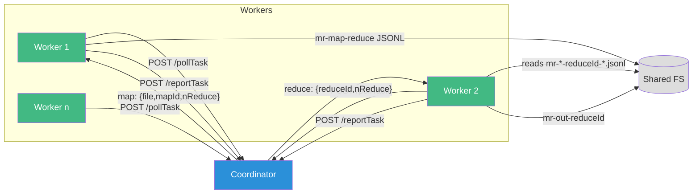

# TypeScript MapReduce

Minimal, strictly typed MapReduce for local exploration. One HTTP/JSON coordinator, many workers, plugin-defined map/reduce, file-based intermediates.

## Overview



## Quickstart

Create a few inputs:

```bash
mkdir -p data
printf 'all your base are belong to us\n' > data/pg-1.txt
printf 'base base base all of them\n' > data/pg-2.txt
printf 'to be or not to be base\n' > data/pg-3.txt
```

Run the coordinator (Bun):

```bash
bun run src/coordinator.mts --port=8787 --nReduce=4 "data/pg-*.txt"
# expected: "coordinator :8787 maps=3 reduces=4"
```

Start a few workers:

```bash
bun run src/worker.mts --coord=http://127.0.0.1:8787 --plugin=./plugins/wc.mts
```

Inspect results:

```bash
ls mr-out-*
cat mr-out-* | sort | head -n 20
```

## CLI

```bash
bun run src/coordinator.mts --port=8787 --nReduce=4 "data/pg-*.txt"

bun run src/worker.mts --coord=http://127.0.0.1:8787 --plugin=./plugins/wc.mts
```

### Commands and flags

Coordinator (positional args are input files/patterns):
- `--port` - HTTP port to listen on (default: 8787)
- `--nReduce` - Number of reduce partitions (default: 4)
- `inputs...` - File paths or glob patterns (required)

Worker:
- `--coord` - Coordinator base URL (default: http://127.0.0.1:8787)
- `--plugin` - Filesystem path to plugin module (default: `./plugins/wc.mts`)
